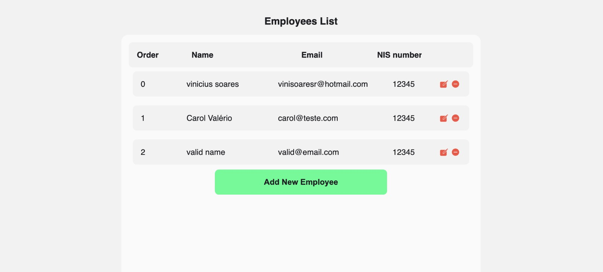
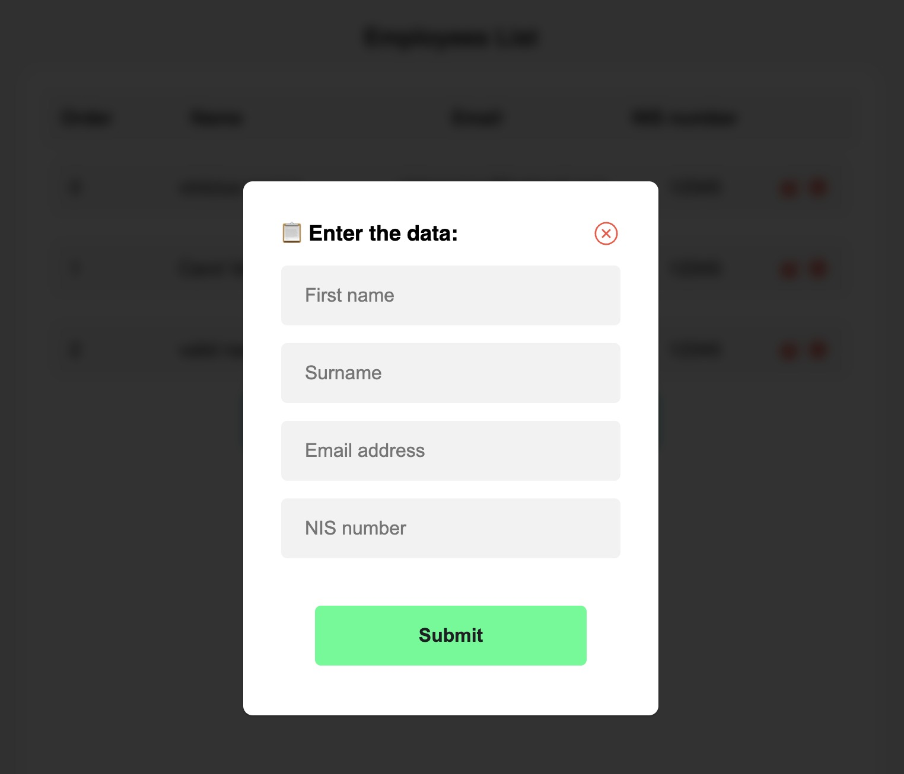

# Basic-CRUD
A Basic CRUD for Employee Registration

## Features

- ⚛️ **React Js** — A JavaScript library for building user interfaces
- 🚀 **NodeJs With Express** — A cross-platform, open-source server runtime for javascript
- 🧪 **Jest** — A JavaScript Testing Framework
- 📄 **MongoDB** — An open-source document-oriented database

## Getting started

1. Clone this repo using `git clone git@github.com:vinisoaresr/Basic-CRUD.git`
2. Move yourself to the appropriate directory: `cd Basic-CRUD`
3. Execute MongoDB Server or run this command in your docker: `docker run -d --name mongodb -p 27017:27017 mongo:latest`

### Getting started with the backend server
1. Move yourself to the backend folder: `cd backend`
2. Create a custom `env.ts` file on `backend/src/main/config/` and insert your MongoDB connection (Default is `mongodb://localhost:27017`)
3. Run `npm start` to start the dev server

### Getting started with the frontend app
1. Move yourself to the frontend folder: `cd frontend`
2. Change in `.env` file on `frontend/src/` a `API_URL` (default is `http://localhost:3000`)
2. Run `npm run dev` to start the web application

## TODO:
- [ ] Move backend test to a specific folder
- [ ] Ensure 100% tests coverage (now is >70% code coverage)

## License
This project is licensed under the MIT License - see the [LICENSE](https://opensource.org/licenses/MIT) page for details.

  

